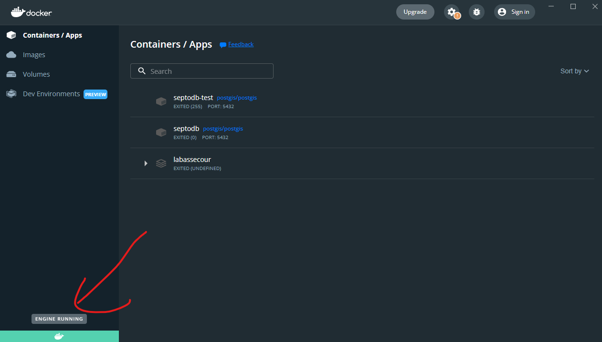
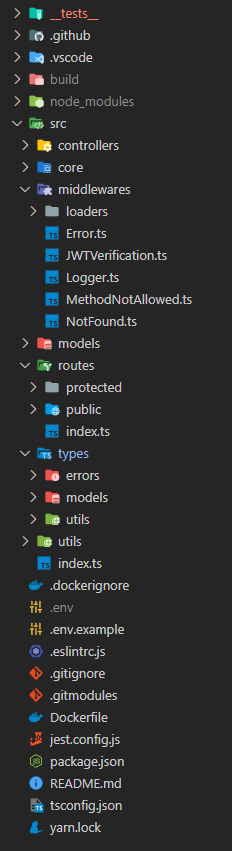

# Documentation développeur de l'API

## Sommaire

- [Documentation développeur de l'API](#documentation-développeur-de-lapi)
	- [Sommaire](#sommaire)
	- [Installation d'un environnement de développement](#installation-dun-environnement-de-développement)
		- [Prérequis](#prérequis)
		- [Installation d'une base de données et d'un service de stockage en local](#installation-dune-base-de-données-et-dun-service-de-stockage-en-local)
		- [Clonage du dépôt Github et installation des dépendances](#clonage-du-dépôt-github-et-installation-des-dépendances)
		- [Configuration de l'API](#configuration-de-lapi)
	- [Structure et organisation du code](#structure-et-organisation-du-code)
	- [Ajouter de nouveaux éléments à l'API](#ajouter-de-nouveaux-éléments-à-lapi)
		- [Créer un nouveau modèle](#créer-un-nouveau-modèle)
			- [Création d'un type](#création-dun-type)
				- [Types](#types)
				- [Prédicats de type](#prédicats-de-type)
			- [Création d'un modèle](#création-dun-modèle)
				- [Modèle](#modèle)
			- [Init](#init)
			- [Associate](#associate)
		- [Créer une nouvelle route](#créer-une-nouvelle-route)
			- [Création d'un contrôleur](#création-dun-contrôleur)
			- [Création d'un middleware](#création-dun-middleware)

## Installation d'un environnement de développement

### Prérequis

- Node.js 16
- Docker (recommandé)

### Installation d'une base de données et d'un service de stockage en local

*Dans cette partie, nous allons voir l'installation de ces éléments avec Docker, mais il est également possible d'installer directement PostGres et Minio en local directement, ou d'utiliser un serveur externe avec un service S3 et PostGres d'accessible.*  

Afin de pouvoir développer sur l'API, nous allons commencer par installer les éléments indispensables au fonctionnement de celle ci.  
Pour cela, assurez vous que le service Docker est lancé. Pour s'en assurer : 
- Sur Linux, tapez la commande suivante : 
```
systemctl is-active docker
```
Si la commande affiche `active` alors Docker est bien lancé. Sinon, revérifiez votre installation de Docker.
- Sur Windows, ouvrez l'application `Docker Desktop` et vérifiez que le logo Docker en bas à gauche indique `ENGINE RUNNING`, sinon revérifiez votre installation de Docker.



Maintenant que Docker est lancé, ouvrez un terminal et tapez les commandes suivantes : 
```bash
# Sur linux, il se peut qu'il faille executer ces commandes en tant que root
docker run -p 5432:5432 --name septodb-dev -e POSTGRES_DB=septoblique-dev -e POSTGRES_USER=api -e POSTGRES_PASSWORD=aaa -d postgis/postgis

docker run -p 9000:9000 -p 9001:9001 -e MINIO_ROOT_USER=api -e MINIO_ROOT_PASSWORD=password -e MINIO_BROWSER_REDIRECT_URL=http://stash.localhost minio/minio server /data --console-address ":9001"
```

Si aucune erreur n'est renvoyée, vous avez alors une base de données et un service de stockage S3 disponible en local.

### Clonage du dépôt Github et installation des dépendances

Pour importer tout le projet, ouvrez un terminal et tapez les commandes suivantes : 
```bash
# Si cette commande ne fonctionne pas, connectez vous à github avec git
git clone git@github.com:La-Sectoblique/septotrip-api.git
cd septotrip-api
# Pour importer les types
git submodule init
git submodule update
```

Une fois le projet cloné et complet, installez `yarn` si ce n'est pas déjà fait avec la commande `npm install --global yarn`.   
Installez ensuite les dépendances du projet avec la commande `yarn install`.

Une fois l'installation terminée, tapez la commande `yarn build` pour être sûr que tout est installé correctement. 

### Configuration de l'API

Une fois le repo cloné et les dépendances installées, nous allons configurer l'API pour qu'elle fonctionne dans un environnement de développement.  
Pour cela, clonez le fichier `.env.example` et renommez le en `.env`, puis, remplissez le ainsi : 

```properties
# GLOBAL
NODE_ENV=development
API_PORT=3000
# POSTGRES
POSTGRES_HOST=localhost
POSTGRES_DB=septoblique-dev
POSTGRES_USER=api
POSTGRES_PASSWORD=aaa
POSTGRES_PORT=5432
# SECURITY
JWT_SECRET_KEY=unechainedecaracterestreslonguepourlagenerationdetokenjwt
# S3
S3_ACCESS_KEY_ID=api
S3_SECRET_ACCESS_KEY=password
S3_ENDPOINT=localhost
```

Si vous avez configuré Minio ou Postgres différement, remplissez le `.env` avec les informations correspondantes.

Pour être sur que l'api est correctement paramétrée, tapez la commande `yarn dev` pour la lancer avec `nodemon`.

Si l'API se lance, tout est correctement installé !

## Structure et organisation du code

Le code de l'API est structuré ainsi : 



L'essentiel du code de l'API se trouve dans le dossier `src`. Celui est structuré de cette manière : 

- controllers

Ce dossier contient tous les contrôleurs qui détiennent l'essentiel de l'intelligence de l'API. Chaque fichier contient les contrôleurs d'un item précis (exemple: `Trip.ts` contient les contrôleurs des voyages).

- core

Ce dossier contient tous les éléments de base de l'api, comme les fonctions de connexion à la base de données, par exemple.

- middlewares
	- loaders

Le dossier `middlewares` contient toutes les fonctions qui sont appelées avant les contrôleurs lors d'un appel sur une route. Le dossier `loaders` contient tous les middlewares qui vont chercher en base une entité en base de données avant que le contrôleur ne la manipule.

- models

Ce dossier contient tous les modèles de la base de données ainsi que leurs relations entre eux.

- routes
	- protected
	- public

Le dossier `routes` contient toutes les routes exposées par l'API. Le dossier `protected` contient toutes les routes accessibles uniquement en étant connecté à un compte utilisateur, tandis que le dossier `public` contient toutes les routes accessibles sans être connecté.

- types
	- errors
	- models
	- utils

Le dossier `types` contient toutes les déclarations de types. 
Le dossier `errors` contient les déclarations d'erreurs, le dossier `models` les déclarations de modèles et le dossier `utils` d'autres types importants.

- utils

Ce dossier contient plusieurs fonctions généralistes.

## Ajouter de nouveaux éléments à l'API

### Créer un nouveau modèle

Maintenant, nous allons voir comment ajouter une nouvelle table dans la base de données. Dans cet exemple, nous allons rajouter un modèle `NotepadEntry` qui représente un moyen de transport.
Le modèle `NotepadEntry` contiendrait un nom, une contenu et un auteur.

#### Création d'un type

Pour cela, on va commencer par créer un type pour notre modèle. Pour cela, on va créer un fichier `NotepadEntry.ts` dans le dossier `src/types/models` et le remplir ainsi : 

```ts
import { CommonAttributes, isCommonAttributes } from "./Common";

// types
export type NotepadEntryAttributes = {
	name: string;
	content: string;
	authorId: number;
};

export type NotepadEntryInput = NotepadEntryAttributes;
export type NotepadEntryOutput = NotepadEntryAttributes & CommonAttributes;

// type predicates
export function isNotepadEntryAttributes(object: unknown): object is NotepadEntryAttributes {
	return (
		(object as NotepadEntryAttributes).name !== undefined &&
		(object as NotepadEntryAttributes).content !== undefined &&
		(object as NotepadEntryAttributes).authorId !== undefined &&
	);
}

export function isNotepadEntryInput(object: unknown): object is NotepadEntryInput {
	return (
		isNotepadEntryAttributes(object)
	);
}

export function isNotepadEntryOutput(object: unknown): object is NotepadEntryOutput {
	return (
		isNotepadEntryAttributes(object) &&
		isCommonAttributes(object)
	);
}

export function isNotepadEntryOutputArray(objects: unknown[]): objects is NotepadEntryOutput[] {
	return objects.every( object => isNotepadEntryOutput(object) );
}
```

Un fichier de type est divisé en 2 parties principales : la déclaration des types et la prédicats de types.

##### Types

Regardons la première partie du fichier qui contient les types :
```ts
// types
export type NotepadEntryAttributes = {
	name: string;
	content: string;
	authorId: number;
};

export type NotepadEntryInput = NotepadEntryAttributes;
export type NotepadEntryOutput = NotepadEntryAttributes & CommonAttributes;
```

On voit la déclaration de 3 types : 
- l'Attributes, qui contient l'ensemble des propriétés d'un type,
- l'Input, qui contient toutes les propriétés qu'on rentre en base de données
- l'Output, qui contient toutes les propriétés qui resssorte de la base de données

##### Prédicats de type

Les prédicats de type sont des fonctions qui permettent de définir si un objet inconnu est d'un type donnée. Ces fonctions servent de vérification pour chaque type. Chaque fonction est nommé `is<Nom du type>` (exemple: `isNotepadEntryAttributes`) et vérifie si toutes les propriétés obligatoire du type sont présent dans l'objet, et si les valeurs rentrés sont valable si besoin.

#### Création d'un modèle 

Une fois le type créé, on peut passer a la création du modèle pour la base de données. Pour cela, créez un fichier `NotepadEntry.ts` dans le dossier `src/models` et le remplir ainsi : 

```ts
import { DataTypes, Model, Sequelize } from "sequelize";
import { NotepadEntryAttributes, NotepadEntryInput } from "../types/models/NotepadEntry";
import { User } from "./User";

export class NotepadEntry extends Model<NotepadEntryAttributes, NotepadEntryInput> implements NotepadEntryAttributes {
	declare name: string;
	declare content: string;
	declare authorId: number;
}

export function init(sequelize: Sequelize): void {
	NotepadEntry.init({
		name: {
			type: DataTypes.STRING,
			allowNull: false,
		},
		content: {
			type: DataTypes.TEXT,
			allowNull: false
		},
		authorId: {
			type: DataTypes.NUMBER,
			allowNull: false
		}
	}, {
		sequelize,
		tableName: "NotepadEntry"
	});
}

export function associate() {
	NotepadEntry.belongsTo(User, {
		foreignKey: "authorId",
		targetKey: "id",
		as: "author"
	});
}
```

Un fichier de modèle est divisé en 3 parties : 

##### Modèle 

```ts
export class NotepadEntry extends Model<NotepadEntryAttributes, NotepadEntryInput> implements NotepadEntryAttributes {
	declare name: string;
	declare content: string;
	declare authorId: number;
}
```

Le modèle est une classe qui étends la classe `Model` de Sequelize et implémente le type `NotepadEntryAttributes`. La classe `Model` prends également 2 types génériques : le type Attributes qui contient les attributs a rentrer en base, et le type Input, qui contient les attributs a rentrer lors de la création d'une entité en base.

A l'intérieur de cette classe, on déclare les différentes propriétés du modèle.

#### Init

```ts
export function init(sequelize: Sequelize): void {
	NotepadEntry.init({
		name: {
			type: DataTypes.STRING,
			allowNull: false,
		},
		content: {
			type: DataTypes.TEXT,
			allowNull: false
		},
		authorId: {
			type: DataTypes.NUMBER,
			allowNull: false
		}
	}, {
		sequelize,
		tableName: "NotepadEntry"
	});
}
```

Cette fonction embarque la fonction `init` du modèle déclaré, et permet de renseigner tout les types SQL de chaque propriété, ainsi que d'autres infos comme le nom de la table en base.

Pour chaque propriété, il faut renseigner au moins les propriétés `type` et `allowNull`.

#### Associate

```ts
export function associate() {
	NotepadEntry.belongsTo(User, {
		foreignKey: "authorId",
		targetKey: "id",
		as: "author"
	});
}
```

Cette fonction permet de définir les relations entre les modèles de la base. Pour plus de détails, vous pouvez vous référer à la [documentation de Sequelize](https://sequelize.org/docs/v6/core-concepts/assocs/).

Et voilà, vous avez créer un modèle ! Il n'y a plus qu'a redémarrer l'API et vous pourrez voir la table créée en base.

### Créer une nouvelle route

Nous allons maintenant voir comment créer une route d'API et les fonctions qui sont derrière.

#### Création d'un contrôleur

Pour créer un contrôleur, créez un fichier dans le dossier `src/controllers` avec un nom correspondant au modèle que votre contrôleur va modifier, ou modifiez un fichier déjà existant.

Une fonction d'un contrôleur est structuré ainsi : 
```ts
import { Request, Response, NextFunction } from "express";

// ....

export async function LeNomDeVotreFonction(request: Request, response: Response, next: NextFunction) {
	// votre code ici

	response.json(/* ce que vous souhaitez retourner */);
}
```

La fonction `next` dans les contrôleurs renvoie vers le middleware d'erreur.

#### Création d'un middleware

Pour créer un middleware, créez un fichier dans le dossier `src/middleware` avec un nom correspondant à ce que votre middleware va faire.

La structure est globalement identique à celle d'un contrôleur, excepté 