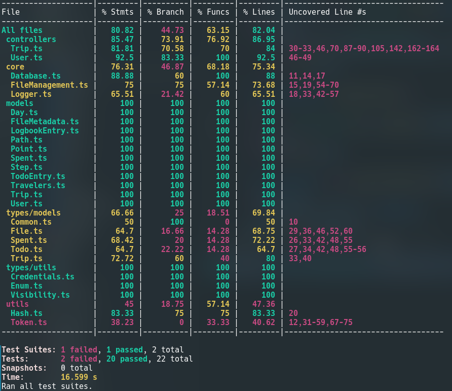

# Rapport test unitaires

Nous avons décidé de faire les tests unitaires sur l'API de notre projet. 
En effet, c'est sur ce projet que se concentre l'essentiel de l'intelligence du projet (création, modification et suppression des éléments, vérification des données, etc).

L'API est créé en TypeScript et utilise les librairies Express et Sequelize. 
Nous avons donc choisi `ts-jest` pour nos tests unitaires, couplé avec le package `@jest-mock/express` afin de faciliter le test de nos controlleurs express et `faker` afin de créer un jeu de données réaliste.

## Qu'est ce qui a été testé ? 

Nous avons fait le choix de tester les controlleurs, car il représente la quasi totalité de l'intelligence de l'api. De plus, tester les controlleurs permet de tester indirectement les modèles de la base de données.

Plus spécifiquement, nous avons décidé de tester les controlleurs gérant les utilisateurs et les voyages. 

## Quelles leçons en tirés ?

Mettre en place ces tests unitaires nous a permis de mettre en valeur certains défauts de conception dans le code de ces controlleurs.  
Par exemple, nous avons pu remarquer qu'aucune vérification n'était effectué sur la forme des informations rentrées en base (aucune verification sur si l'adresse mail est bien une adresse mail).  
Nous avons également remarqué que certains codes d'erreurs renvoyés n'était pas les bons.

## Rapport de couverture du code par les tests

## Code source 

[Code source de l'api](https://github.com/La-Sectoblique/septotrip-api)

Les tests sont disponible dans le dossier `__tests__`.